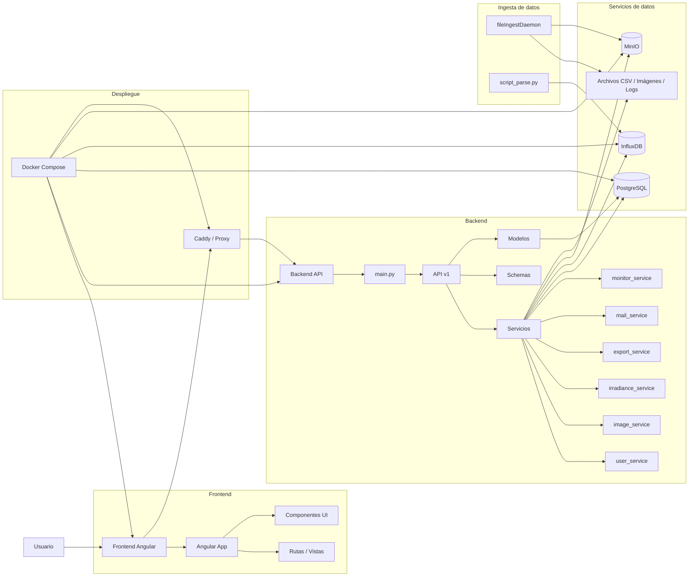

# Diagrama de Componentes
El diagrama de componentes muestra la arquitectura general del sistema, destacando los principales componentes y sus interacciones. Este diagrama se ha elaborado a partir del análisis del código fuente, la estructura de carpetas y la documentación disponible. Esto fue hecho con la herramienta Tree Command para visualizar la estructura del proyecto y luego se tradujo a un diagrama de componentes utilizando Mermaid.

```bash
tree -L 3 
```
se obtuvo la siguiente estructura del proyecto:
