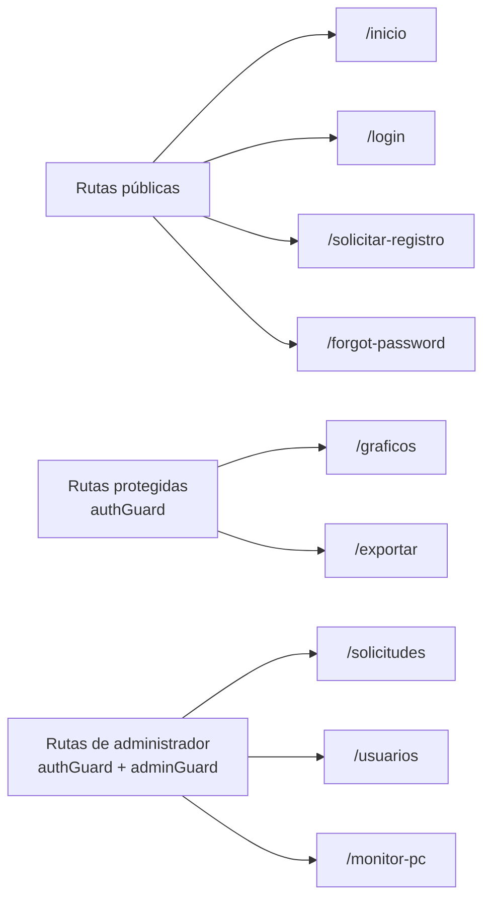

# Rutas del frontend
Usando el comando desde la carpeta raíz del proyecto:

```bash
grep -R "path:" frontend/app/src/app
```

se identificaron las siguientes rutas en el frontend de Angular:

```mermaid
flowchart LR

    Publico["Rutas públicas"] --> Inicio["/inicio"]
    Publico --> Login["/login"]
    Publico --> Registro["/solicitar-registro"]
    Publico --> Recuperar["/forgot-password"]

    Protegidas["Rutas protegidas<br/>authGuard"] --> Graficos["/graficos"]
    Protegidas --> Exportar["/exportar"]

    Admin["Rutas de administrador<br/>authGuard + adminGuard"] --> Solicitudes["/solicitudes"]
    Admin --> Usuarios["/usuarios"]
    Admin --> Monitor["/monitor-pc"]
```